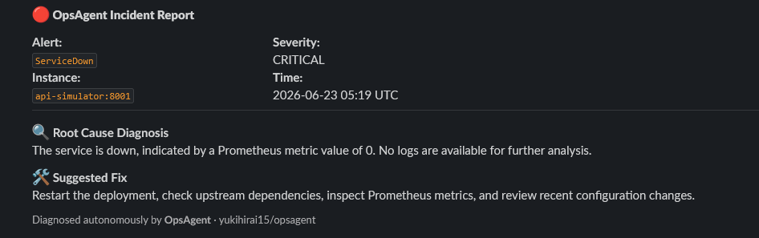

# OpsAgent 🤖

**Autonomous AI DevOps agent - monitors Prometheus alerts, diagnoses root cause, and suggests fixes.**

Built with LangChain + LangGraph, FastAPI, Prometheus, and Slack webhooks.  
Part of the **[PulseStack](https://github.com/yukihirai15/prod-api-platform)** ecosystem.

---

[](https://github.com/yukihirai15/Ops_Agent/actions)
[](https://python.org)
[](https://langchain-ai.github.io/langgraph/)
[](https://docker.com)
[](LICENSE)

---

## What It Does



OpsAgent sits between Prometheus AlertManager and your on-call team. When an alert fires:

1. **Queries Prometheus** for recent metrics on the affected service
2. **Inspects logs** (Loki or Docker) for error patterns
3. **Generates a remediation plan** using an LLM sub-agent
4. **Posts a structured incident report** to Slack

No human in the loop. No manual runbooks. Just autonomous triage.

---

## Architecture

```
Prometheus Alert
      │
      ▼
AlertManager ──POST──▶ OpsAgent FastAPI (/webhook/alertmanager)
                              │
                              ▼
                    ┌─── LangGraph Agent ───┐
                    │                       │
                    │  ┌─────────────────┐  │
                    │  │  query_          │  │
                    │  │  prometheus()   │  │
                    │  └────────┬────────┘  │
                    │           │           │
                    │  ┌────────▼────────┐  │
                    │  │  check_logs()   │  │
                    │  └────────┬────────┘  │
                    │           │           │
                    │  ┌────────▼────────┐  │
                    │  │  suggest_fix()  │  │
                    │  └────────┬────────┘  │
                    │           │           │
                    │  ┌────────▼────────┐  │
                    │  │  notify_slack() │  │
                    │  └─────────────────┘  │
                    └───────────────────────┘
                              │
                              ▼
                        Slack Channel
                    (structured incident report)
```

### LangGraph State Machine

```
[entry] → agent_node → (tool call?) → tool_node → agent_node → ... → END
```

The agent iterates autonomously until it completes all four tools or hits `max_iterations`.

---

## Toolset

| Tool | Purpose | Fallback |
|------|---------|----------|
| `query_prometheus()` | PromQL query via HTTP API | Returns empty result message |
| `check_logs()` | Fetch logs from Loki or Docker | Docker → Loki, graceful skip |
| `suggest_fix()` | LLM-generated SRE remediation plan | Error message returned |
| `notify_slack()` | Block Kit alert to Slack channel | Skip if webhook not configured |

---

## Quickstart

### Prerequisites

- Docker + Docker Compose
- Anthropic API key
- Slack Incoming Webhook URL (optional)

### 1. Clone & configure

```bash
git clone https://github.com/yukihirai15/Ops_Agent.git
cd opsagent
cp .env.example .env
# Edit .env — add ANTHROPIC_API_KEY and SLACK_WEBHOOK_URL
```

### 2. Start the stack

```bash
docker compose up --build
```

Services started:
- `http://localhost:8000` — OpsAgent API
- `http://localhost:9090` — Prometheus
- `http://localhost:9093` — AlertManager

### 3. Test manually

```bash
# Health check
curl http://localhost:8000/health

# Trigger a synthetic alert
curl -X POST http://localhost:8000/run \
  -H "Content-Type: application/json" \
  -d '{
    "alertname": "HighErrorRate",
    "severity": "critical",
    "instance": "api:8000",
    "summary": "HTTP 5xx rate exceeded 5% for 2 minutes"
  }'
```

### 4. Simulate a real AlertManager webhook

```bash
curl -X POST http://localhost:8000/webhook/alertmanager \
  -H "Content-Type: application/json" \
  -d '{
    "version": "4",
    "groupKey": "test-group",
    "status": "firing",
    "alerts": [{
      "status": "firing",
      "labels": {
        "alertname": "ServiceDown",
        "severity": "critical",
        "instance": "worker:8001"
      },
      "annotations": {
        "summary": "Worker service is unreachable"
      }
    }]
  }'
```

---

## Project Structure

```
opsagent/
├── agent/
│   └── graph.py            # LangGraph state machine + agent loop
├── api/
│   └── main.py             # FastAPI: webhook receiver + /run + /health
├── tools/
│   ├── prometheus.py       # query_prometheus() tool
│   ├── logs.py             # check_logs() tool (Loki + Docker)
│   ├── remediation.py      # suggest_fix() tool
│   └── slack.py            # notify_slack() tool (Block Kit)
├── config/
│   └── settings.py         # Pydantic Settings — .env loaded
├── docker/
│   ├── prometheus.yml      # Prometheus scrape config
│   ├── alerts.yml          # Sample alert rules
│   └── alertmanager.yml    # Routes firing alerts to OpsAgent webhook
├── tests/
│   └── test_opsagent.py    # pytest suite — tools + API endpoints
├── .github/workflows/
│   └── ci.yml              # GitHub Actions: lint → test → docker build
├── docker-compose.yml
├── Dockerfile
├── requirements.txt
└── .env.example
```

---

## Configuration

All config via environment variables (`.env` file):

| Variable | Required | Default | Description |
|----------|----------|---------|-------------|
| `ANTHROPIC_API_KEY` | ✅ | — | Claude API key |
| `PROMETHEUS_URL` | ✅ | `http://prometheus:9090` | Prometheus base URL |
| `SLACK_WEBHOOK_URL` | ⬜ | — | Slack Incoming Webhook |
| `LOKI_URL` | ⬜ | — | Grafana Loki URL |
| `DRY_RUN` | ⬜ | `false` | Skip Slack + mutations |
| `LOG_LEVEL` | ⬜ | `info` | Uvicorn log level |
| `MAX_ITERATIONS` | ⬜ | `10` | LangGraph max agent steps |

---

## Running Tests

```bash
pip install -r requirements.txt
pytest tests/ -v
```

---

## Related Projects

| Project | Description |
|---------|-------------|
| [PulseStack](https://github.com/yukihirai15/prod-api-platform) | FastAPI microservice platform with Docker, NGINX, PostgreSQL, Prometheus, GitHub Actions CI/CD |
| [LogScalpel](https://github.com/yukihirai15/netscaler-log-filter) | Python CLI for parsing and filtering NetScaler ns.log files |

---

## Roadmap

- [ ] Grafana dashboard for OpsAgent run history
- [ ] PagerDuty integration as a 5th tool
- [ ] Auto-remediation mode (kubectl rollout restart, etc.)
- [ ] Persistent incident log with SQLite/Postgres
- [ ] Multi-alert correlation across the same instance

---

## License

MIT © [Prashant Bisht](https://yukihirai.in)
